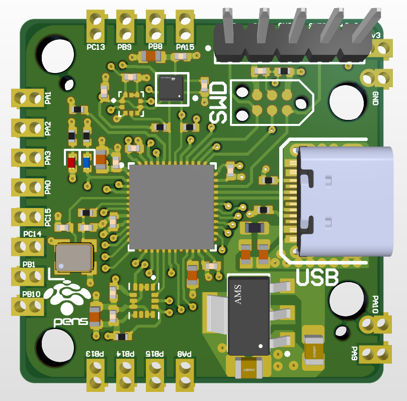
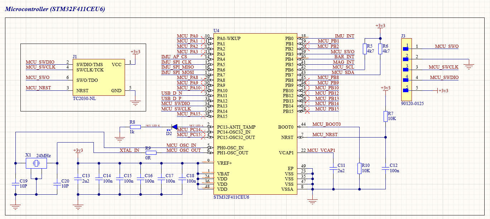
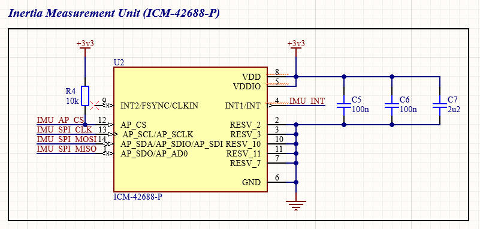
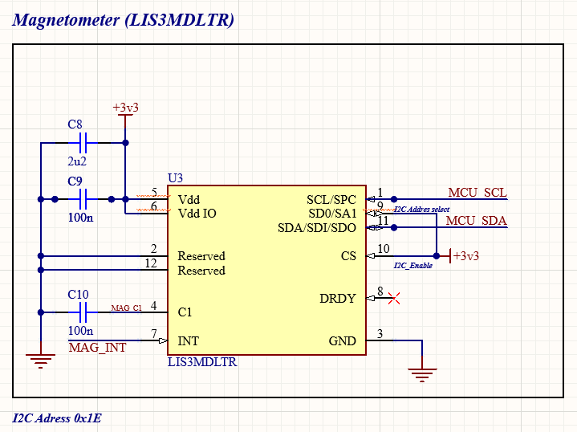
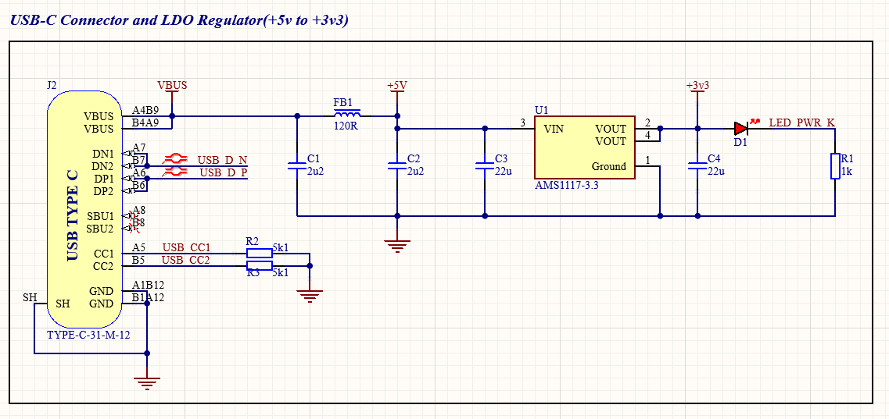

# Motion-Sensing STM32 MCU Module

This project is something I made during my semester break after Semester 2.  
It’s a **motion-sensing capable STM32 MCU module** that could potentially be used as the core of a flight controller.

## 📐 Module Overview

This module includes:
- **6-axis IMU**: ICM-42688-P (SPI)
- **3-axis magnetometer**: LIS3MDL (I2C)
- **Barometer & temperature sensor**: BMP280 (I2C)

## 🖼️ PCB 3D Preview

Here’s a 3D render of the PCB:

  
*Top view*

---

## 📊 Schematics

Below are the schematics for each main component block:

### STM32F411CEU6

---

### ICM-42688-P IMU

---

### LIS3MDL Magnetometer

---

### BMP280 Barometer & Temp Sensor

---

### USB-C

## 📂 Included Files

In this repository, you’ll find:
- **Gerber files** — for PCB manufacturing.
- **CPL file** — for Pick and Place Assembly at JLCPCB.
- **BOM for JLCPCB Assembly** — Bill of Materials for the assembly service.
- **BOM for LCSC** — for ordering components separately if needed.

## ⚠️ Project Status

I haven’t tested all the sensors and connections yet — testing will begin once the PCB and components I ordered have arrived.  
Until then, the hardware design is **unverified** and may require updates.

## 🔄 Future Plans

In the future, I plan to:
- Update this repository once the PCB and parts arrive.
- Test and verify all sensors, connections, and peripherals.
- Upload firmware and example code for motion sensing.
- Potentially develop this module into a **fully functional flight controller**.

---

**Stay tuned for updates!**  
Feel free to use the files or adapt them for your own projects — and please share feedback or suggestions if you have any.
